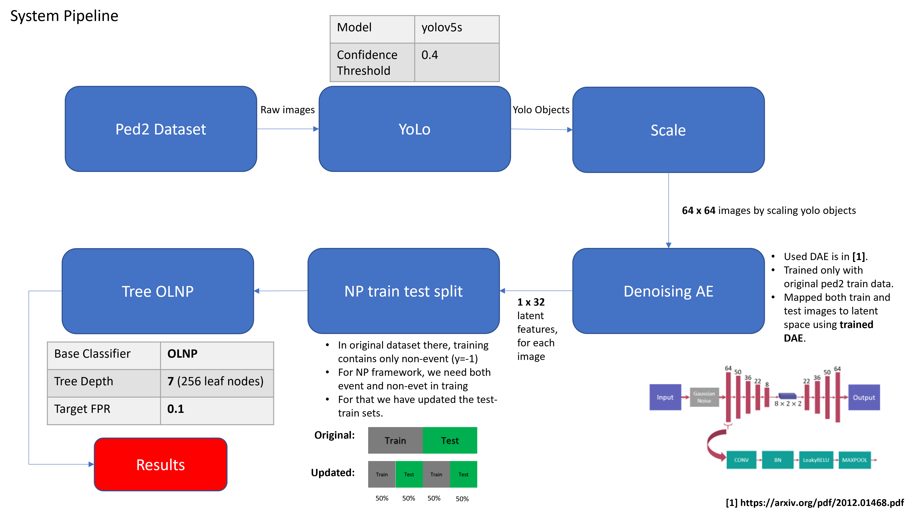

# A Neural Network Approach for Online Nonlinear Neyman-Pearson Classification
This is the repo for detecting objects from UCSDped2 dataset, generate 32 dimensional latent variables using denoising autoencoder as explained in [1]. I have also used some portion of the code available under [2], which is a not official implementation of [1].
Flow diagram of the system is given below:

# Running the Pipeline
create_yolo_objects jupyter notebook detects images using yolov5 and saved the scaled objects under output/scaled_objects.
DAE notebook reads the scaled objects created by aforementioned notebook and maps them to 32 dimensional latent variables under.
32 dimensional feature is saved under output/ped2.mat

Thanks!
Basarbatu Can

# References
[1] Ouyang, Yuqi, and Victor Sanchez. "Video Anomaly Detection by Estimating Likelihood of Representations." 2020 25th International Conference on Pattern Recognition (ICPR). IEEE, 2021.
[2] https://github.com/wufan-tb/gmm_dae